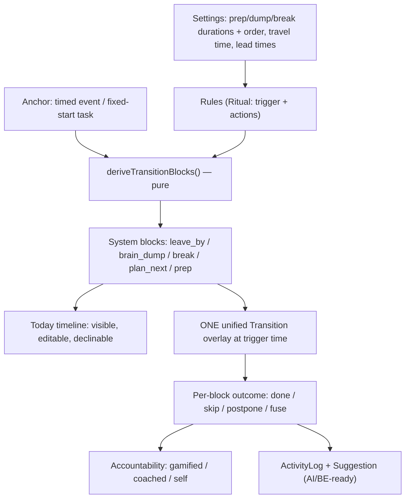

# Needle — Master Plan: Desktop Next-Level + the Transition System

> **Status:** Authoritative master plan. Written 2026-05-31 (Ofer driving).
> Supersedes the scattered direction across three inputs and reconciles them into one
> implement-ready, parallelizable plan.
>
> **Inputs reconciled:**
> 1. Ofer's direction (faithful capture: [needle-next-master-plan-DRAFT.md](needle-next-master-plan-DRAFT.md) — keep as the raw requirements appendix).
> 2. Cursor plan "Needle desktop next level" (docs-first, ui-web-shared, Transition System). **Primary structural basis.**
> 3. Codex plan "Desktop-First" (operational rigor: stabilize-first gate, acceptance criteria, manual smoke).
>
> **How to use this doc (for humans and AI agents):**
> - §1–§5 are *decisions and architecture* — read before touching code. Do not re-litigate.
> - §6 is the *parallelization map* — which work packages can run at once, and on what model tier.
> - §7 (Part A: docs) and §8 (Part B: build) are *self-contained work packages*. Each has an
>   ID, goal, inputs, target files, steps, acceptance, dependencies, and "parallel-safe with".
>   A subagent (even a smaller model) should be able to pick up one WP from its ID alone.
> - §9 is the *research appendix* (capture/time-machine, day-planning UX, anti-habituation),
>   written from prior knowledge and flagged where live web verification is still owed.
> - §10 requirement-coverage map. §11 risks.

---

## 1. North Star & product framing (do not drift)

**Needle is a transition coach — not a task manager, not a timer.** It catches you between
tasks/meetings, makes you let go of the last thing (a quick brain-dump), and starts you clean.
Authoritative framing: [docs/positioning.md](../positioning.md).

Success metric (Ofer's words): **"Users should feel calmer at 2PM than they did at 9AM."**
The product reduces anxiety about forgetting important commitments.

**The one feature that must finally work:** help me *commit to my day* and let me *brain-dump*
between contexts — through **one predictable flow**, not two blinking screens.

**`apps/desktop` is the product Ofer dogfoods.** `apps/studio` is the browser preview of the
shared UI; `prototype/*` are visual references only.

---

## 2. Decisions resolved (authoritative — these settle the conflicts between the three plans)

| # | Decision | Why / supersedes |
|---|----------|------------------|
| **D1** | **Feature UI lands in `@needle/ui-web`** (pure + presentational), previewed in `apps/studio` (browser), then **consumed by `apps/desktop`**. Desktop owns only the *native shell*: windows, IPC, SQLite, capture, sound/haptics, meeting detection. | Ofer's explicit choice ("Shared ui-web, desktop consumes"). Honors the monorepo F3 seam ([monorepo-migration-plan.md](monorepo-migration-plan.md)). Matches Cursor plan. **Overrides Codex/antigravity's "build straight into desktop."** |
| **D2** | **Subtasks are first-class `Item`s linked by `ItemRelation(type='contains')`. NEVER embedded `subtasks?: Subtask[]` durable arrays.** UI may *project* a child tree for rendering; storage stays item + relation. | Reaffirms the 2026-05-26/27 v2 decision and Codex. **Explicitly rejects the antigravity plan's `Subtask` recursive redefinition + `buildSubtaskTree` over an embedded array.** Projection helper belongs in `ui-web/model`, not in the domain type. |
| **D3** | **Tag colors are a curated semantic-token palette, not raw hex/HSL.** The color picker offers N pre-approved token swatches; `Tag.color` stores a token key (e.g. `tag-rose`), resolved to light+dark values in CSS. | `design-tokens.mdc`: "semantic tokens only, never raw hex." **Overrides antigravity/Cursor's `color: string` free hex.** |
| **D4** | **`commitmentLevel` stays internal** (drives intervention intensity + `unmissable → leave_by`). **Tags are the user-facing categorization.** The nice "unmissable/committed" *visual* is repurposed into tag chips. | Ofer + Codex + Cursor all agree. |
| **D5** | **One canonical v2 model end-to-end.** Collapse the current dual world (`useAppStore` legacy `Task`/`CalendarEvent` ↔ `useV2Store`/`fixture-v2.ts` + half-used v2 SQL) onto `Item`/`ItemPlan`/`ItemOccurrence`/`ItemRelation` ([domain-v2.ts](../../packages/domain/src/domain-v2.ts)). Today, the transition engine, tags, and AI all read one truth. | Cursor plan. Required for the engine + AI/BE readiness. |
| **D6** | **The transition/interrupt logic is ONE pure, deterministic function** over the model (`deriveTransitionBlocks(anchors, rules, settings, now)`), living in `ui-web/model` (promote into `@needle/domain` once validated). It must be moveable to the NestJS backend untouched and fully legible to AI. | Ofer ("BE-ahead, available to AI"). Cursor. The `window.api` IPC stays the connect seam. |
| **D7** | **Derived transition blocks are REAL, VISIBLE, EDITABLE items on the timeline** (`generated_from` the anchor+rule), not hidden interventions. The *same* derived blocks are the single source the overlay reads. | Fixes "3 hidden system events"; makes the day predictable. Ofer + Cursor. |
| **D8** | **Native capabilities (time-machine capture, meeting detection, haptics) are documented now, spiked behind flags, disabled by default.** No signing/entitlement/`forge.config.ts` changes without an explicit Ofer ask (`macos.mdc`). | Keeps the desktop MVP shippable; protects notarization. Codex + Cursor + `git-and-changes.mdc`. |
| **D9** | **Docs-first.** Write the design docs (Part A) before/parallel to building, so nothing is lost and we never re-decide mid-build. | Ofer ("document everything, lose nothing"). Cursor. |

---

## 3. Architecture spine

```
@needle/domain        canonical model (Item/ItemPlan/ItemOccurrence/ItemRelation, Ritual, Tag*)
   ▲                   *Tag promoted in here once validated in ui-web/model
   │ consumes
@needle/ui-web        pure model logic + presentational React. Browser-verifiable.
   │  model/   deriveTransitionBlocks, buildTodayView, deriveCountdown(+rotation),
   │           coachEngine, applyChat, RevisionLog, ritual/5-5-5, tag projection, mutate
   │  components/  TodayBoard, ItemLine (recursive), InlineAdd, Countdown, TransitionOverlay,
   │           Settings, CoachPanel, ChatDock, RevisionTimeline, Tag chips, BreathHearth, GlassBubbleMat
   ▲ previews            ▲ consumes (same components, data via props/IPC)
   │                     │
apps/studio           apps/desktop
(browser demo,        (native shell: Electron windows, preload IPC, SQLite repository,
 instant iteration)    torch/overlay windows, sound/haptics, capture sidecar, meeting detection)
```

**Key leverage of D1:** because feature UI lands in `ui-web` and is verified in `studio` (browser),
**most of the build can be developed and reviewed before the desktop wiring exists.** This is what
makes the workstreams in §6 genuinely parallel.

---

## 4. The crux: the **Transition System** (the heart — read this twice)

Ofer kept circling the real question: *what is the "event", what triggers it, and how do I see it
coming?* The answer is one small robust engine.

**Definitions**
- **Anchor** — a timed commitment: an event with an `ItemOccurrence`, or a fixed-start task.
- **Rule** — built on the existing `Ritual` shape (`trigger` + `actions`). User-configurable,
  with sane defaults, saved as settings, overridable per anchor.
- **System blocks** — blocks a rule derives around an anchor, each a real `Item` kind:
  - `leave_by` — from travel time on an unmissable place-event (school-pickup hard stop).
  - `prep` — N min before (configurable).
  - `brain_dump` — the "5" (dump what you're holding so you can let go).
  - `break` — the "5" (reset/decompress).
  - `plan_next` — the "5" (orient to what's next).
  - (kinds are an open enum so new ones — e.g. `travel`, `hydrate` — add later.)

**The function (pure, deterministic):**
```
deriveTransitionBlocks(anchors, rules, settings, now) -> SystemBlock[]
```
Same inputs → same blocks. No `Date.now()` inside; `now` is passed. This is what lets it move to
the BE and be driven/inspected by AI.

**Two consumers, one source:**
1. **The Today timeline** renders the derived blocks as predictable, editable rows you can decline
   ("skip the break") *in advance*. This is the "checkboxes that reflect what will happen" Ofer asked for.
2. **The unified Transition overlay** at trigger time reads the *same* blocks and shows a **unified
   state**: "5 to dump → 5 to break → 5 to prep", order configurable, with one **fuse / skip /
   postpone** control. "Skip the break, ping me in 5" folds that block's time into the rest in a
   single click.



**This is the bug fix — root cause confirmed in code.** The single `ritualPreMeeting` ritual in
[fixture-v2.ts:583](../../apps/desktop/src/renderer/state/fixture-v2.ts) fires **three** actions:
`modal_capture` (intensity 2) scheduled **14:55**, linked to the **prep task** (`itemTodayPrep`);
`attention_takeover_torch` (intensity 4) scheduled **14:59**, linked to the **1:1 event**
(`itemEvent1on1`); and `escalated_alert` **15:00**. [InterventionLayer.tsx](../../apps/desktop/src/renderer/components/Intervention/InterventionLayer.tsx)
then drives a **capture window** (effect at ~L99) *and* a **torch window** (effect at ~L55) in two
independent effects, each keyed to a different `itemId` — so both can surface, the capture one never
cleanly resolves, and skipping leaves the second. That's the blink + two dump screens exactly.
The engine emits **one ordered sequence**; the overlay renders **one surface**; closing/skipping
resolves the **session once**, not per surface. WP-B4 retires `CaptureWindow` + `BrainDumpPanel` +
this fixture path.

---

## 5. Pre-flight reality check (must be true before Part B build starts)

> **Corrected after live grounding (2026-05-31).** `memory/context.md` said the repo "does NOT
> compile / Phase 4 ~70%". The newer [studio-handoff.md](studio-handoff.md) is authoritative and
> reports the opposite: `pnpm --filter @needle/ui-web typecheck` and
> `pnpm --filter @needle/studio typecheck` are both **GREEN**; `App.tsx` is wired (`useTemplates`,
> `TemplatesScreen`, `GalleryScreen`, gallery CSS); KanbanLayout + TemplateBuilder built+registered.
> **Remaining for studio Phase 4:** run the full verify block (lint, test, studio build), click
> through in-browser (custom-template persist/delete, Kanban switch), flip docs to ✅, then **commit**
> the still-untracked `packages/ui-web/` + `apps/studio/`.

**So WP-B1 is a verify-and-commit gate, not a rescue.** It's still a hard serial gate (nothing
should build on an uncommitted, unverified base), but it's hours, not days.

### 5.1 Existing-assets inventory — REUSE, do not rebuild  *(critical for subagents)*

A large share of what the Cursor/Codex/antigravity plans describe as "new" **already exists in
`@needle/ui-web` (Phases 0–4)**. Subagents MUST build on these, not re-create them:

| Capability | Already exists as | WP that extends it |
|---|---|---|
| Relation-backed children (`contains`) + single-level `childProgress` | `model/today.ts` (`childrenOf`, `buildTodayView`) | WP-B2 makes it **recursive (3 levels)** |
| Item row w/ inline edit, `task-123` autolink, subtask add | `components/ItemLine.tsx` | WP-B2 (recursion, collapse, kill placeholder, tags) |
| Inline composer (manual + ✨ AI parse, time chip) | `components/InlineAdd.tsx` + `model/parse.ts` | WP-B2 (**drop `*`/`**` markup**, AI "clean up" → editable blocks, add-after-last) |
| Next-hard-stop countdown + **app-icon badge + floating card + alert-style rotation** | `components/Countdown.tsx` + `model/countdown.ts` (`deriveCountdown`, `rotateAlertStyle`, `nextHardStop`) | WP-B2 clarity copy; WP-B7 desktop surfaces |
| **5/5/5 brain-dump** w/ per-block countdown + skip/postpone drift cost | `components/BrainDump.tsx` + `model/ritual.ts` | WP-B4 feeds it from `deriveTransitionBlocks`; wraps in unified overlay |
| Travel-prep → **"Leave by HH:MM"** unmissable hard stop via `prep_for` | `model/mutate.ts` (`addTravelPrep`) | WP-B3 folds into the rule engine |
| Notification settings (lead times, quiet hours, rotation pool, sound) | `components/NotificationSettings.tsx` + `model/notify.ts` | WP-B3 Settings page builds on it |
| Accountability — 3 modes (gamified/coached/self) + nudges | `components/CoachPanel.tsx` + `model/coach.ts` (`Adherence`) | WP-B6 wires transition outcomes in |
| "3 of N done" kudos | `components/ProgressKudos.tsx` | WP-B6 |
| AI chat (scripted) + **revertible revisions w/ one-click undo** | `components/ChatDock.tsx` + `model/chat.ts`; `components/RevisionTimeline.tsx` + `model/revision.ts` (`RevisionLog.undo()`) | covers Ofer's "versioning / undo of AI changes" (§ requirement) |
| Pure transforms returning new `TodayData` | `model/mutate.ts` (`toggleItemDone`, `addChild`, `addItem`, `addEvent`, `pullYesterdayUnfinished`) | WP-B2 day-targeting wires these to real moves |
| Templates as pure config (Editorial/Compact/Timeline/Kanban + builder) | `model/template.ts`, `components/layouts/*` | WP-B2 adds `subtaskDisplay` option |

**Genuinely NEW work (does not exist yet — verified):**
1. `deriveTransitionBlocks(anchors, rules, settings, now)` — the engine (WP-B3 / DOC-A1). `ritual.ts`
   has `createRitual/advanceRitual/cost` but **no anchor→blocks derivation**.
2. The **`Tag` model** + UI (DOC-A3 / WP-B2) — no tag entity exists anywhere.
3. The unified **`TransitionOverlay`** component (WP-B4) — assembles existing BrainDump + Countdown +
   breath into one surface; does not exist.
4. **Recursive (multi-level) ItemLine** + collapse + leaf-placeholder removal (WP-B2).
5. **Desktop v2 unification** — desktop still runs the dual store (`store.ts` legacy +
   `store-v2.ts`/`fixture-v2.ts`/`selectors-v2.ts`) and the **racing interventions live in
   `apps/desktop`, NOT ui-web** (`InterventionLayer.tsx`, `CaptureWindow.tsx`, `BrainDumpPanel.tsx`,
   `TorchWindow.tsx`, `fixture-v2.ts`). This is WP-B1.5 + the desktop half of WP-B4.
6. Native spikes: time-machine capture, meeting detection, haptics (WP-B8/B9, DOC-A2/A5).

> **Note on the breath / Glass Bubble Mat:** these are in `prototype/v7/index.html` (HTML/CSS
> reference), **not yet ported** to `ui-web`. WP-B4 ports the Breathing Hearth; WP-B5 ports the
> Glass Bubble Mat. Treat v7 as the visual source.

---

## 6. Workstream map & parallelization (the orchestration layer)

Five tracks. Within a track, WPs are mostly serial; across tracks they run in parallel once the
gate (WP-B1) clears. Each WP notes a **model tier**: `T1` = top model (architecture/engine),
`T2` = mid (feature UI from a clear spec), `T3` = capable-but-cheaper (docs/research/mechanical).

```
GATE ─ WP-B1 Stabilize & commit (T1)  ──────────────────────────────────────────────┐
                                                                                      │
DOCS TRACK (Part A — start immediately, parallel, mostly independent):                │
  DOC-A1 transition-system.md (T1, the heart — others reference it)                   │
  DOC-A2 brain-dump-and-time-machine.md (T2, research-heavy)                          │
  DOC-A3 tags.md (T3) · DOC-A4 feedback-sound-haptics.md (T3)                         │
  DOC-A5 meeting-awareness.md (T3) · DOC-A6 desktop-redesign.md + ADR + memory (T2)   │
                                                                                      ▼
UI-WEB TRACK (browser-verified in studio; the bulk of the build):
  WP-B2 Today UI fixes (T2)  ┐
  WP-B3 Transition engine + Settings UI (T1, needs DOC-A1)  │ B2 ∥ B3 ∥ B5(pure parts)
  WP-B4 Unified TransitionOverlay (T1/T2, needs B3)         │
  WP-B5 Feedback bus + delights (pure/config) (T2)          ┘
  WP-B6 Accountability/coach wiring (T2, needs B4 outcomes)

DESKTOP TRACK (native shell; needs WP-B1; can start WP-B1.5 in parallel with UI-WEB track):
  WP-B1.5 Desktop consumes ui-web + unify on v2 model + v2 repository/IPC (T1, biggest single change)
  WP-B7 Desktop integration of each ui-web feature as it lands (overlay via torch window,
        settings persistence, sound, day-targeting IPC) (T2)

NATIVE SPIKES TRACK (independent, flagged, disabled by default):
  WP-B8 Time-machine capture sidecar (T1, needs DOC-A2)
  WP-B9 Meeting-join detection (T1, needs DOC-A5)
```

**Parallel-safe at peak (after gate + DOC-A1):** DOC-A2..A6 ∥ WP-B2 ∥ WP-B3 ∥ WP-B5 ∥ WP-B1.5 ∥
WP-B8 ∥ WP-B9. That's up to ~7 agents at once. WP-B4 waits on B3; WP-B6 waits on B4; WP-B7 trails
each ui-web feature; desktop-side of overlay waits on WP-B4 + WP-B1.5.

**Conflict-avoidance for parallel agents (worktree-friendly):** the tracks touch disjoint paths —
docs touch `docs/`, ui-web feature WPs touch `packages/ui-web/src/{model,components}/*` (split by
feature folder), desktop WPs touch `apps/desktop/src/{main,renderer}/*`, native spikes touch a new
`apps/desktop/native/*` sidecar. The one shared hotspot is `packages/ui-web/src/model/index.ts`
(the barrel) and `apps/desktop/.../repository.ts` — serialize edits to those two files or assign
them to a single owner per phase.

---

## 7. Part A — Design docs to write FIRST (nothing lost)

All under `docs/v2/`, linked from [docs/v2/README.md](README.md) and `memory/decisions.md`. Each
captures intent + the concrete model so implementation never re-decides. These are ideal for
parallel agents and need no compiling repo.

### DOC-A1 — `docs/v2/transition-system.md`  *(T1 — the heart; write first, others cite it)*
**Goal:** fully specify §4 so it can be implemented and moved to BE.
**Must contain:** anchors; the rule shape (reuse `Ritual` `trigger`+`actions`); the
`deriveTransitionBlocks(anchors, rules, settings, now)` contract + determinism guarantees; the
system-block `Item` kinds (`brain_dump`/`prep`/`break`/`plan_next`/`leave_by`, open enum) and how
they're stored (`generated_from` relation so they're regenerable, never orphaned, and removed when
the anchor moves/deletes); timeline rendering rules; how the unified overlay consumes them;
fuse/skip/postpone semantics + knock-on cost (declining a block reallocates its minutes); the
AI/BE seam (pure fn, `ActivityLog` + `Suggestion`). **Supersede** [vertical-slice-3pm-meeting.md](vertical-slice-3pm-meeting.md) (mark it historical).
**Acceptance:** an engineer can implement `deriveTransitionBlocks` + the overlay contract from this
doc alone; every Ofer requirement about events/predictability/unified-state/fuse is addressed.

### DOC-A2 — `docs/v2/brain-dump-and-time-machine.md`  *(T2 — research-heavy; see §9.1)*
**Goal:** capture the brain-dump UX and the macOS storytelling/time-machine vision so it's never lost.
**Must contain:** (a) brain-dump UX: one calm surface, "very simple but powerful", optional voice,
"where to pick up from", in-dump chat + countdown; (b) the time-machine research — rolling 5–10 min
buffer via **ScreenCaptureKit + AVAssetWriter fragmented-mp4 / HLS ~1s segment ring buffer**,
hardware H.265 ~720p@5fps (~2–5 MB/min), concatenate-on-save via stream-copy; **voice narration**;
**context capture** (frontmost app via `NSWorkspace`, browser URL + selection via Accessibility,
click/cursor-highlight trail); permissions/entitlements (Screen Recording, Microphone,
Accessibility); the **bundled-Swift-sidecar** approach (Electron main spawns a notarized helper,
IPC over stdio/local socket); privacy/local-only stance (and the **Microsoft Recall backlash**
lesson — encrypt at rest, easy pause, per-app exclusion, visible recording indicator); and a
brainstormed **extra-ideas** section (auto-dump on detected context switch; "what was I doing"
recovery; AI summary of last N min pre-filling the dump; commit-message/standup/Slack recap;
searchable OCR timeline; redaction of sensitive windows; "rewind to the bug" → attach clip to task;
keyboard "bookmark this moment"). Cross-reference the existing
[2026-05-31-macos-accessibility-capture.md](../superpowers/specs/2026-05-31-macos-accessibility-capture.md)
and **fold §9.1 of this plan in**.
**Acceptance:** Ofer's "very very important" capture vision is fully recorded with feasibility +
new ideas; WP-B8 can be scoped from it.

### DOC-A3 — `docs/v2/tags.md`  *(T3)*
**Goal:** spec user tags. **Must contain:** `Tag` entity (id, name, **token-key color** per D3,
optional `automation` metadata), item↔tag link (`item.tagIds` or `ItemTag`), SQLite migration,
how tags replace user-facing commit/bucket chrome while `commitmentLevel` stays internal (D4),
compact chip rendering rules, and **future tag-driven automations modeled as rules in the same
engine** (select tag → auto-create follow-up task/block). **Acceptance:** WP-B2 tag slice + a
migration can be built from it.

### DOC-A4 — `docs/v2/feedback-sound-haptics.md`  *(T3)*
**Goal:** spec the extensible feedback layer. **Must contain:** a named **feedback event bus**
(`item.added`, `item.completed`, `day.first_completed` → fireworks, `transition.started`,
`block.done`, `capture.saved`, `hard_stop`) mapped to sound + haptic in user config; open/closed so
new events/cues drop in without touching call sites; macOS specifics (bundled audio via Web Audio /
`NSSound`; **haptics via a small native module** `NSHapticFeedbackManager`, user-initiated only);
respects mute, quiet hours, `prefers-reduced-motion`; gentle defaults, centrally disable-able.
**Acceptance:** WP-B5 implements the bus from this; no celebration logic scattered in components.

### DOC-A5 — `docs/v2/meeting-awareness.md`  *(T3)*
**Goal:** spec meeting-join detection. **Must contain:** detect whether the user actually *joined*
a meeting — `CoreMediaIO`/`CoreAudio` mic+cam-in-use (`kAudioDevicePropertyDeviceIsRunningSomewhere`),
frontmost app (`NSWorkspace`), browser URL heuristics (`meet.google.com`, `*.zoom.us/j`,
`teams.microsoft.com/l/meetup-join`), Accessibility tree (Mute/Leave buttons); permission UX
(`systemPreferences.getMediaAccessStatus`); uses: accountability ("on-time arrival") and
**softening/cancelling an interrupt if already in the meeting**. **Acceptance:** WP-B9 spike scoped.

### DOC-A6 — `docs/v2/desktop-redesign.md` + ADR + memory  *(T2)*
**Goal:** the UI master doc + **requirement-coverage map** (every Ofer item → a WP), the
day-targeting model (today / tomorrow+date / someday=`stash` / pull-yesterday), countdown clarity,
composer simplification, settings, accountability modes, Glass Bubble Mat + the breath, spacing,
3-level subtasks, collapse. Plus ADR `docs/decisions/2026-06-01-desktop-transition-system.md` and an
appended `memory/decisions.md` entry. **Acceptance:** a reader sees exactly what's planned vs built.

---

## 8. Part B — Build phases (each ends shippable + verified)

> Feature work lands in `@needle/ui-web`, **browser-verified in `apps/studio` first**, then desktop
> consumes it. Every WP ends green: `pnpm typecheck && pnpm lint` for the touched workspace, plus
> the stated manual smoke. Bug fixes get a failing-first Vitest (`testing.mdc`).

### WP-B1 — Verify & commit the studio base (the gate)  *(T2; serial; blocks all of Part B)*
**Goal:** the green-but-uncommitted studio base is verified end-to-end and committed; desktop
baseline known. (Per §5: typecheck is already GREEN — this is verify+commit, not a rescue.)
**Steps:**
1. Run the full studio verify block (per [studio-handoff.md](studio-handoff.md) Step 4):
   `pnpm --filter @needle/ui-web typecheck|lint|test` (17 tests), `pnpm --filter @needle/studio
   typecheck|lint|build`. Click through in-browser at `localhost:5180` (template switch incl.
   Kanban; build a custom template → persists across reload → delete; open Components/Gallery).
2. Flip studio Phase 4 → ✅ in [studio-redesign.md](studio-redesign.md) + the
   [ADR](../decisions/2026-05-31-ui-web-studio-redesign.md); append `memory/decisions.md`.
3. Desktop baseline: `pnpm --filter @needle/desktop typecheck|lint|test`; fix only blockers (incl.
   the `better-sqlite3` ABI drift noted in memory — a `pnpm rebuild better-sqlite3` is the usual
   fix). `pnpm start` boots.
4. **Commit** the untracked `packages/ui-web/` + `apps/studio/` + doc edits (one green commit).
   Record exact baseline truth (what passes/fails) in WP notes. (Ignore the unrelated pre-existing
   `prototype/index copy.html`.)
**Acceptance:** all four workspaces typecheck+lint+test; studio click-through clean; desktop boots;
ui-web+studio committed. **Parallel-safe with:** DOC-A1..A6 (docs need no compile).

### WP-B1.5 — Desktop consumes `ui-web` + unify on v2 model  *(T1; biggest single change; gate for desktop UI)*
**Goal:** desktop renders the studio look from the canonical model.
**Steps:**
1. Add `@needle/ui-web` dep to `apps/desktop`; load `@needle/ui-web/styles`. Validate CSP/fonts in
   the Electron renderer early (low risk — ui-web is self-contained via `@fontsource`).
2. Replace the legacy Today render path (`TodayScreen`/`TaskRow`/`EventRow`/`ItemRow` + local
   `primitives/`) with ui-web `TodayBoard`/`ItemLine`/layouts, fed by a canonical `TodayData`.
3. Drive `TodayData` from the v2 SQLite tables — extend `repository.ts` + db IPC; **retire the
   dual-store split** (`useAppStore` legacy ↔ `useV2Store`/`fixture-v2.ts`) onto one v2 path (D5).
**Acceptance:** `pnpm start` → Today renders from SQLite via ui-web; legacy `Task`/`CalendarEvent`
selectors gone; typecheck/lint/tests green. **Depends on:** WP-B1. **Parallel-safe with:** the
ui-web feature WPs (they're verified in studio without desktop).

### WP-B2 — Today UI fixes  *(T2; lands in ui-web; verify in studio)*
**Goal:** every Today complaint Ofer listed, fixed.
**Scope:**
- **Recursive 3-level subtasks (generic):** recursive `ItemLine` over `childrenOf` with a `depth`
  cap (config, default 3, extensible); deeper → compact "more nested" affordance, never broken
  layout. Nested `childProgress`. **Storage stays `ItemRelation(type='contains')` (D2).**
- **Collapse subtasks:** add `subtaskDisplay: 'inline' | 'collapsed' | 'hidden'` to `Template`;
  collapsed shows e.g. "▸ 2 of 3", expand on click; collapse/expand only when children exist.
- **Tighter spacing + kill the leaf placeholder:** remove the always-rendered children block for
  leaf items; "add subtask" becomes an explicit hover/keyboard affordance, not reserved space.
  Re-tune `--space-*`.
- **Tags** (D3/D4): render token-colored chips in `ItemLine`; create/assign/remove; curated swatch
  picker. Replaces commit/bucket chrome.
- **Day-targeting:** Today / Tomorrow(+date) / Someday(`stash`) / **pull-yesterday's-unfinished**
  (`mutate.ts` `pullYesterdayUnfinished`) wired to real moves; quick row actions; events stay
  non-checkable.
- **Composer simplification:** plain text = add item; **drop `*`/`**` markup**; explicit indent
  (Tab / "+ under last") to nest; ✨ AI toggle for natural language; **inline add after the last
  item**; an **AI "clean this up"** button that returns *editable draft blocks*, raw text stays
  visible, **persist only on confirm** (no silent mutation). (UX rationale: §9.2.)
- **Delete** items/notes; confirm **reorder** works in the new board.
- **Countdown clarity:** label "Next hard stop · HH:MM (in Xm)" + one-line explanation; keep alert
  rotation (`countdown.ts`).
**Acceptance:** in studio: leaf rows are compact (no placeholder); 3 levels render + collapse; tags
chip; day-targeting moves work; composer adds inline w/o markup; AI-clean produces editable blocks;
delete + reorder work; countdown is self-explanatory. **Parallel-safe with:** WP-B3, B5, B1.5.

### WP-B3 — Transition engine + Settings UI  *(T1; needs DOC-A1)*
**Goal:** the model on the timeline + the settings that drive it.
**Steps:**
1. Implement `deriveTransitionBlocks` (pure, `ui-web/model`, promote-later) + rule defaults.
2. Render derived system blocks on the timeline as predictable, editable, **declinable** rows.
3. **Settings page:** prep/dump/break durations + **order**, travel time, lead times, quiet hours,
   which alert styles rotate, sound/haptics toggles (build on `NotificationSettings.tsx`). Save as
   per-user defaults, overridable per anchor. Keep advanced config behind a disclosure (non-advanced
   users get working defaults).
4. Fold the existing travel→`leave_by` (`addTravelPrep`) into the rule engine.
**Acceptance:** in studio, creating a 15:00 unmissable meeting auto-shows `leave_by` + 5/5/5 blocks
at the right times; declining the break reallocates its minutes. **Parallel-safe with:** B2, B5.

### WP-B4 — One unified Transition overlay  *(T1/T2; needs B3; kills the double-screen)*
**Goal:** one predictable transition surface.
**Steps:**
1. `ui-web` `<TransitionOverlay>` driven by derived blocks: **unified state** (the system blocks
   together), per-block countdown, the **breath** (port v7 Breathing Hearth), single
   **fuse / skip / postpone** control with knock-on cost.
2. **Desktop side** (WP-B7 dependency): reuse the torch window machinery (`apps/desktop/.../torch.ts`:
   multi-display, click-through) to render the overlay; **retire** the racing `CaptureWindow` +
   `BrainDumpPanel` + `modal_capture` fixture path; auto-resolve/supersede so the flow is
   deterministic; one session resolves once.
**Acceptance:** step the dev clock 14:50→14:55→14:59→15:00: exactly one predictable surface, never a
second ghost dump; `brainDumpText` saved once; fuse/skip/postpone behave; outcomes still logged.
**Depends on:** WP-B3 (blocks) + WP-B1.5 (desktop consuming ui-web) for the desktop half.

### WP-B5 — Feedback bus + delights  *(T2; needs DOC-A4; pure/config parts parallel-safe)*
**Goal:** sound/haptics/celebration behind one adapter, gentle defaults.
**Steps:** implement the feedback event bus + config (pure, ui-web); bundle a few calm sounds; wire
add/complete/firstComplete/captureSaved/ritualStarted/hardStop; **Glass Bubble Mat** (port v7) as a
decompression surface; **fireworks on first completion** (opt-in). Haptics native module is the
desktop half (flagged, WP-B7). Respect reduced-motion/quiet-hours.
**Acceptance:** completing a task fires one `item.completed` event → sound (if enabled); first
completion → fireworks; all centrally disable-able. **Parallel-safe with:** B2, B3.

### WP-B6 — Accountability modes  *(T2; needs B4 outcomes)*
**Goal:** calm, motivating accountability.
**Steps:** wire transition adherence (done/skip/postpone/fuse + cost) and task progress into
`coach.ts` (gamified / coached / self) per [accountability-and-scoring.md](accountability-and-scoring.md);
surface "3 of 5 done / on track" + streaks + kudos calmly; **self-mode = write-to-future-self**
message replayed at the moment. **Acceptance:** completing 3/5 shows an on-track nudge; modes switch;
nothing nags. **Depends on:** B4.

### WP-B7 — Desktop integration of ui-web features  *(T2; trails each ui-web WP)*
**Goal:** each ui-web feature works in the real app.
**Scope:** overlay via torch window (B4); settings persistence + IPC; day-targeting moves persisted
via `repository.ts`/IPC; sound playback in renderer; **haptics native module (flagged)**; countdown
on app-icon/Dock badge + an always-on-top floating pill (§9.3). **Acceptance:** features verified in
studio also work in `pnpm start`. **Depends on:** the corresponding ui-web WP + WP-B1.5.

### WP-B8 — Time-machine capture sidecar  *(T1; needs DOC-A2; flagged, disabled by default)*
**Goal:** prove the rolling-buffer capture.
**Steps:** bundled Swift sidecar (ScreenCaptureKit ring buffer + voice + context metadata),
save-last-5-min via stream-copy concat, scrub overlay, permissions request flow. Disabled by
default; **confirm before touching signing/entitlements/`forge.config.ts`** (D8).
**Acceptance:** behind a flag, the last 5 min can be saved + scrubbed locally; off by default; no
notarization regressions. **Parallel-safe with:** everything (new `apps/desktop/native/*` path).

### WP-B9 — Meeting-join detection  *(T1; needs DOC-A5; flagged, disabled by default)*
**Goal:** prove join detection. **Steps:** CoreMediaIO mic/cam + frontmost-app + URL heuristics in
the sidecar/main; permission UX; emit a "joined meeting" signal that softens/cancels an interrupt
and feeds accountability. Disabled by default. **Acceptance:** behind a flag, joining a Meet/Zoom
call is detected within a few seconds; off by default. **Parallel-safe with:** everything.

---

## 9. Research appendix
> Live web pass completed 2026-05-31 (sources cited inline). Fold these verbatim into DOC-A2/A5/A6.

### 9.1 macOS storytelling capture & "time machine" — prior art, feasibility, extra ideas

**Prior art (verified live):**
- **Rewind.ai** — *was* the canonical "time machine for your Mac": always-on local screen+audio,
  on-device transcription, **~3750× proprietary compression** (~5 GB/yr heavy use, sub-0.5s search
  on M3), **local-only by default**, macOS 13+ via ScreenCaptureKit. The **EFF audited it Sept 2024
  and found zero privacy leaks** in simulated attacks — strong evidence the local-only model can be
  done right. **⚠️ Critical:** rebranded to **Limitless**, acquired by **Meta**, and **all screen/
  audio capture was disabled 2025-12-19** — the original app is sunset. *Implication: a credible,
  privacy-first local "time machine" is now a market gap, and Needle's brain-dump capture can own a
  slice of it (narrowly: transition storytelling, not total-recall surveillance).*
- **screenpipe** (rewind.sh) — **open-source** Rewind alternative; the reference to study now that
  Rewind is gone. Local, scriptable.
- **Microsoft Recall** — *the cautionary tale.* v1 stored screenshots in an **unencrypted SQLite
  DB** any local process could read — researcher Kevin Beaumont called it "a keylogger built into
  the OS"; pulled pre-launch after mass backlash ("Hell no / why would anyone want this"). Relaunched
  Apr 2025: **strictly opt-in**, **encrypted at rest** (BitLocker/Device Encryption), **VBS secure
  enclave**, **Windows Hello biometric gate**, **per-app/site exclusion**. Even so, the sensitive-
  content filter is **still leaky** (passwords/cards slip through) and the EU flagged **GDPR data-
  minimization** concerns. **Non-negotiable defaults Needle must adopt from day one:** opt-in,
  encrypt at rest, biometric/OS-auth gate to view, per-app exclusion, **visible recording
  indicator**, one-tap pause, local-only. **And: do NOT capture-everything by default** — Needle
  captures only a *short rolling buffer* around an explicit transition, which is inherently more
  defensible than total recall.
- **Granola / Otter / Fathom** — meeting capture via local system-audio tap, no calendar-bot.
  Validates "just listen locally" for meeting context (DOC-A5).
- **Screen Studio / CleanShot** — local capture with auto cursor-highlight/zoom; proof the
  cursor-highlight UX is achievable on macOS.

**Feasibility (verified — matches the existing capture spec):** ScreenCaptureKit (macOS 12.3+)
`SCStreamOutput` callback → **AVAssetWriter** with **`movieFragmentInterval`** for fragmented MP4
(keeps the file readable mid-write, single-file, no merge step), hardware **H.264/HEVC** encoding.
For a rolling buffer: ~720p/5fps → low CPU on Apple Silicon, ~2–5 MB/min; save = stream-copy concat.
**Gotchas surfaced by practitioners:** SCK throws **error 3821 and disconnects** under resource
pressure (need robust buffer mgmt); **mic + system audio need separate `AVAssetWriterInput`s** with
matching format descriptions (interleaving mismatched rates corrupts the container). Context via
`NSWorkspace.frontmostApplication`; browser URL/selection via Accessibility; cursor trail via a
transparent click-through overlay. Run as a **bundled, notarized Swift sidecar** spawned by Electron
main over stdio/local socket — native APIs out of the renderer, signing risk isolated.
*Reference impl:* `nonstrict-hq/ScreenCaptureKit-Recording-example` (GitHub).

**Extra ideas Ofer didn't list (candidates for DOC-A2):**
- **Auto-dump trigger:** when meeting-join detection (WP-B9) fires *or* a big context switch is
  detected, offer to save the last N minutes as the brain-dump automatically.
- **AI pre-fill:** summarize the last 5 min (OCR + active app/URL trail + voice) into a *draft*
  brain-dump the user edits — turns the scary blank textarea into an edit task.
- **"What was I doing?" recovery** after an interruption (the core ADHD pain).
- **Bookmark-this-moment hotkey** so the buffer keeps interesting spans / marks them for the dump.
- **Output adapters:** one captured story → commit message / standup / Slack recap / task notes.
- **Redaction:** per-app exclusion (password managers, banking, incognito) via SCK window filtering;
  visible recording indicator; encrypt at rest; one-tap pause.
- **"Rewind to the bug":** scrub the buffer, clip a span, attach to a task as evidence.

### 9.2 Inline day-planning / AI capture UX (verified live)
**Findings:** **Sunsama** is the gold standard for *committing to a day*: a guided **morning ritual**
(review yesterday → pick the day's few priorities → time-block → built-in **overcommit limits**) and
a shutdown ritual — praised specifically for **ADHD/decision-fatigue** because it helps you *simplify
and choose*, not just collect. **Akiflow** is the opposite pole: keyboard-first **natural-language
capture** ("standup 10am 15m") in <5s. They're complementary, and Needle wants **both poles**: the
calm commit-ritual (feeds the transition system + accountability) *and* fast inline NL add.
**Recommendation (matches Ofer):** plain-text inline add is the default; a ✨ toggle enables NL
parsing; an AI **"clean this up"** button converts messy text into *editable draft blocks*
(task/event/note · today/tomorrow/date/someday · fixed/flexible · optional time); raw input stays
visible; **persist only on confirm**; **no `*`/`**` markup**. This is exactly WP-B2's composer. A
lightweight Sunsama-style **"plan today"** ritual (pick today's priorities, pull yesterday's
unfinished) is a strong future addition — note it in DOC-A6, build after the core lands.

### 9.3 Anti-habituation countdown for ADHD (verified live)
**Findings:** ADHD time-blindness is a **measurable deficit** (dopamine in the basal ganglia sets
internal-clock speed) — the present dominates; future deadlines aren't *felt*. The research
consensus: **visibility beats alerts.** **Alert fatigue/habituation is real** — stacking pings makes
the brain ignore *all* of them; the fix is **quality over quantity** and an **always-visible,
ambient** cue (the **Time Timer's shrinking colored disk** is the archetype: always present, no
notification needed). **Design implications for Needle:**
1. Lead with an **always-visible ambient countdown** (a shrinking/▢ visual, not just a number), not
   a notification stream.
2. When you *do* escalate, **rotate the modality** (color / motion / scale / position / sound) so it
   never habituates — but stay calm, not slot-machine. (This is `deriveCountdown` + `rotateAlertStyle`
   already in `countdown.ts`.)
3. **Multi-surface, low-frequency:** in-app countdown + Dock/app-icon badge + an always-on-top
   floating pill; few, high-quality escalations rather than many pings.
4. Respect `prefers-reduced-motion`. Extended in WP-B2 (clarity) + WP-B7 (desktop surfaces).

### 9.4 Sources
- Rewind.ai / Limitless / Meta sunset + EFF audit + compression: aitools.aiting.com/ai/rewind,
  ucstrategies.com/news/rewind-ai-mac-memory-search-tool-specs-privacy-pricing-2026, rewind.sh
  (screenpipe).
- Microsoft Recall backlash/redesign: venturebeat.com (opt-in + double-encrypted), DoublePulsar
  (Kevin Beaumont), en.wikipedia.org/wiki/Microsoft_Recall, windowsforum.com.
- ScreenCaptureKit/AVAssetWriter: nonstrict.eu/blog/2023/recording-to-disk-with-screencapturekit,
  github.com/nonstrict-hq/ScreenCaptureKit-Recording-example, fatbobman.com (metadata arch),
  fazm.ai/blog/screencapturekit-screen-recording-encoding-approach.
- Sunsama vs Akiflow: morgen.so/blog-posts/sunsama-vs-akiflow, efficient.app/compare/sunsama-vs-akiflow.
- ADHD time blindness / habituation: timetimer.com/blogs/news/time-blindness,
  super-productivity.com/blog/adhd-time-blindness-strategies, simplypsychology.org/adhd-time-blindness.html.

---

## 10. Requirement coverage map (nothing dropped)
- Studio look in the real app → **WP-B1.5**. · Collapse subtasks → **B2**. · 3 levels, generic
  (relation-backed) → **B2 + D2**. · Tags w/ token color + future automations → **DOC-A3 + B2**. ·
  Spacing + leaf placeholder → **B2**. · Events / "leave by" / travel + per-anchor 5/5/5 reflected on
  the UI → **DOC-A1 + B3**. · Accountability/scoring + "3 of 5" kudos → **DOC-A6 + B6**. · The breath
  → **B4**. · Composer confusing (`*`/`**`) → **B2**. · Glass Bubble Mat → **B5**. · Day targeting
  (today/someday/tomorrow/pull-yesterday) → **B2**. · Countdown "next hard stop" clarity +
  anti-habituation multi-surface → **B2 + B7 + §9.3**. · Settings (prep time, hard start,
  notification lead time/intensity) → **DOC-A6 + B3**. · Meeting-join via accessibility → **DOC-A5 +
  B9**. · Reordering → **B2**. · Sound/haptics extensible, on by default but open → **DOC-A4 + B5/B7**.
  · Inline free-text add + AI fix, no silent mutation → **B2 + §9.2**. · Delete items/notes → **B2**.
  · Brain-dump that helps you commit, ONE new UI, predictable, kill duplicates → **DOC-A1 + B3/B4**.
  · The "event trigger" question answered → **DOC-A1 (§4)**. · Hide complexity from non-advanced
  users → settings opt-in, defaults work (**B3**). · AI/BE-ready, available to AI → pure engine +
  ActivityLog/Suggestion throughout (**D6**). · Versioning/undo of AI changes → existing `RevisionLog`
  (ui-web), surfaced via RevisionTimeline; extend in **B6/chat**. · Time-machine screen+voice+context,
  auto last 5–10 min → **DOC-A2 + B8**. · Chat to the AI (questions like "how long to get there?") →
  ChatDock + `applyChat` (ui-web), wired through the engine; spec in **DOC-A1/A6**.

## 11. Risks / open decisions
- **ui-web in an Electron renderer** (CSP, fonts) — low risk (self-contained); validate early in WP-B1.5.
- **The v2 model unification (WP-B1.5)** is the biggest single change; it gates desktop UI, so it
  goes first on the desktop track and gets its own verify gate.
- **Native modules** (haptics, capture/meeting sidecar) complicate signing/notarization — keep them
  flagged + isolated in `apps/desktop/native/*`; **confirm before touching `forge.config.ts`/
  entitlements** (D8, `macos.mdc`).
- **Parallel-edit hotspots:** `ui-web/model/index.ts` barrel and desktop `repository.ts` — assign a
  single owner per phase or serialize.
- **Research debt:** §9 ⚠️ items need a live web pass folded into DOC-A2/A6 once tools recover.

---

## 12. Immediate next actions (when you say go)
1. **WP-B1** (verify + commit the green studio base) — serial gate, do first. ~hours.
2. In parallel, kick off **DOC-A1** (transition-system, the heart) — it unblocks B3/B4 conceptually.
3. Then fan out: DOC-A2..A6 ∥ WP-B2 ∥ WP-B3 ∥ WP-B1.5 ∥ (WP-B8/B9 spikes if desired).
4. Run the §9 ⚠️ live-research pass and fold into DOC-A2/A6 (still owed — web tools were
   intermittent the session this plan was written).

> **Reuse discipline (see §5.1):** before building anything, check the existing-assets table.
> Most "features" here are *extensions* of code already in `ui-web`, not greenfield. The truly new
> pieces are: `deriveTransitionBlocks`, the `Tag` model, the `TransitionOverlay`, recursive
> `ItemLine`, and the desktop v2 unification.

> Raw, unfiltered requirements (every word Ofer wrote) live in
> [needle-next-master-plan-DRAFT.md](needle-next-master-plan-DRAFT.md) — keep as the appendix of record.
